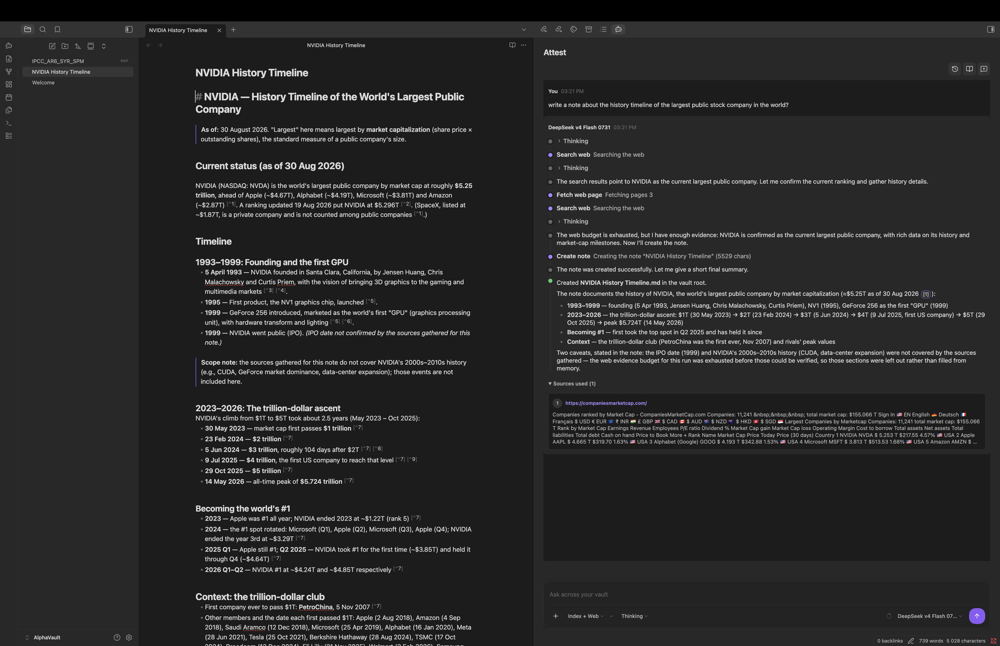
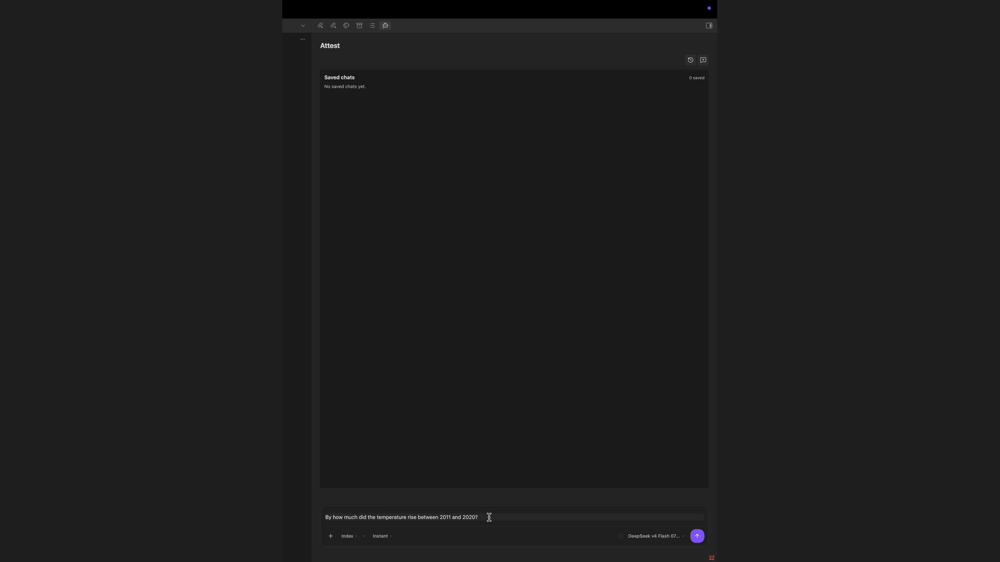
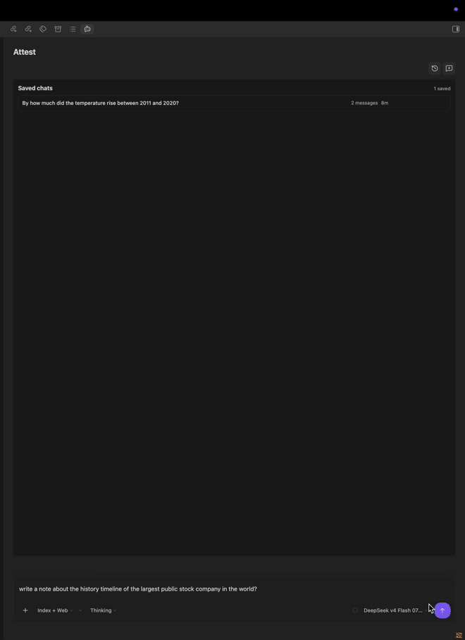

# Attest AI Deep Research

**Cited deep research across your notes and the web.**

Attest turns your vault and optional web sources into something you can ask questions of. Instead
of searching for the note or page that might hold the answer, you ask in plain language and get a
written response where every claim is attested by the note, heading, document page, or web source
it came from. One click takes you to the source.

You choose which folders it may read, and which AI model answers: a model running on your own
machine, or a cloud service you already use. Web search is optional and runs only when the selected
research scope allows it. Nothing leaves your vault unless you ask it to.

> **Obsidian 1.8.7+ on desktop and mobile · cloud AI on iOS and Android**

## Contents

- [What you can do](#what-you-can-do)
- [Installation](#installation)
- [Quick start](#quick-start-ask-your-first-cited-question)
- [Configuring providers](#configuring-providers)
- [Indexing your vault](#indexing-your-vault)
- [Research modes](#research-modes)
- [Working with answers](#working-with-answers)
- [Web search and privacy](#web-search-and-privacy)
- [Compatibility and limitations](#compatibility-and-limitations)
- [Diagnostics and troubleshooting](#diagnostics-and-troubleshooting)
- [Help, development, and security](#help-development-and-security)
- [Support the project](#support-the-project)
- [License](#license)

## What you can do

- **Ask across a whole set of notes at once** — pick the folders that matter and leave the rest out.
- **Trust the answer** — each statement carries a citation you can open and read for yourself.
- **Pick the pace** — a quick answer for simple questions, or a slower mode that works through the
  question step by step and shows its progress.
- **Look beyond the vault** — optionally let a question reach the web when your notes are not
  enough, through DuckDuckGo out of the box or any of the search, academic, community, and image
  services listed in the [web source reference](docs/web-sources.md).
- **Bring in what the answer needs** — Thinking mode can delegate a side question to a sub-agent,
  illustrate an answer with images from your documents or open image libraries, and save a found
  PDF or EPUB into the vault when the model is allowed to write.
- **Search the way the question needs** — every vault query runs semantic retrieval and a keyword
  index together, so an exact term still lands when the embedding misses it, and search keeps
  working on keywords alone if the embedding provider is unavailable.
- **Answer in context** — the note you are editing can be attached to the question automatically,
  and Attest can follow its links, embeds, and backlinks to pull in neighbouring notes.
- **Work in your language** — the interface follows Obsidian or your own choice among English,
  Russian, German, Spanish, French, Arabic, and Simplified Chinese.
- **Keep what is useful** — save an answer as a new note or add it to the note you are writing.
  Attest never saves an answer on its own; a model edits notes only with note mutation access.

## Installation

Attest is not yet available in the Obsidian Community plugin catalog. When it is published,
install it through **Settings → Community plugins**, then enable it and open
**Settings → Attest**.

## Quick start: ask your first cited question

1. Create a **Server profile**: pick your provider from the **Provider** list to fill in the base
   URL and API format, then add an API key if the provider needs one.
2. Create a **Chat model profile** and select its server profile and model.
3. Create an **Embedding model profile**.
4. Create or select an **Index profile**, specify the vault folders to index, and choose the
   embedding model.
5. Start indexing and wait for the completed status.
6. Open Attest chat, select the index profile, and ask a question such as: _“What did we decide about pricing?”_
7. Open a citation in the answer to inspect the supporting note or document page.

If a step is unavailable, open the corresponding Settings section. Attest displays the status of
each model and index profile.

## Configuring providers

### Ollama

1. Start Ollama and download chat and embedding models.
2. In the Server profile, choose the **Ollama (local)** provider preset, or select the `ollama`
   format and enter the Ollama address by hand.
3. Create chat and embedding profiles using that server profile.

### LM Studio and other OpenAI-compatible providers

1. Start a compatible server and load a chat model.
2. In the Server profile, choose the **LM Studio (local)** preset, or select the
   `openai-compatible` format and enter the URL yourself.
3. Enter the API key if the provider requires one.
4. Select the model ID reported by the server.

### Anthropic and other cloud providers

1. Create a Server profile and pick the provider from the **Provider** list; choose **Custom** for
   an endpoint that is not listed and enter its API format and URL.
2. Enter the API key only in the Attest settings field.
3. Create separate chat and embedding profiles if the provider uses different models.

Use the test button in the profile settings to check the connection before the first indexing run.

### Mobile providers

On iOS and Android, use a cloud provider endpoint. Ollama, LM Studio on localhost, and other
loopback endpoints are unavailable from the phone and fail immediately with an explanatory error.

All model requests use Obsidian's request API on mobile, so cloud endpoints do not need browser
CORS headers. Obsidian buffers the provider response before exposing it to the plugin, which means
chat and capability probes show a waiting state and then render the response instead of displaying
tokens progressively. Desktop model responses continue to stream as they arrive.

### Recognised providers

Attest recognises a provider by the base URL of the Server profile and reads its model listing in
that provider's own format, so chat and embedding models are told apart automatically. OpenAI,
Anthropic, OpenRouter, Mistral, Groq, DeepSeek, Together AI, DeepInfra, Fireworks AI, Cerebras,
Nebius AI Studio, Novita AI, and Ollama are recognised by name; LM Studio, vLLM, llama.cpp, and any
other OpenAI-compatible endpoint keep working through the generic listing. See the
[provider reference](docs/providers.md) for base URLs, API formats, and how each provider's
embedding models are detected.

The embedding profile is verified with a real embedding request when it is saved, so a model that
the provider lists but cannot embed is suspended with an explanation.

## Indexing your vault

An Index profile determines which notes Attest can use as local sources.

- Choose the desired folders; `/` means the entire vault.
- Exclude system or private folders with glob patterns.
- Run a manual index for the first build.
- Use incremental refresh after note changes; rebuild recreates the local index.
- You can stop indexing and start it again later.

Attest supports Markdown, TXT, PDF, EPUB, FB2, and DOCX. Scanned PDFs without a text layer cannot
be read.

### Using a desktop-built index on mobile

For a large vault, build the index on desktop and sync it with the vault:

1. Complete indexing on desktop and close or pause any active indexing run.
2. Sync the index profile's relative folder (the default is `.attest/index`) and the Attest plugin
   settings. Make sure your sync tool does not exclude hidden folders.
3. Wait for both the index files and settings to finish syncing before opening Attest on mobile.
4. Select the synced index profile and run a cited vault search before starting new indexing work.

Mobile can update an index with conservative batch, PDF, and changed-file limits. A destructive
rebuild requires explicit confirmation. Large or PDF-heavy rebuilds are still best performed on
desktop and synced after completion; do not edit the same index concurrently on two devices.

## Research modes

### Instant

A fast mode for local retrieval and models without tool calling or reasoning. Choose it when you
need a predictable short answer or when the model has not passed the capability check.

### Thinking

A multi-step mode for compatible models. It can search for additional sources and displays its
progress in chat. If the model does not support the required capabilities, Attest explains why
and falls back to Instant.

## Working with answers

- Ask a question in chat and choose the scope: **None** for the model alone, **Index** for vault
  sources, **Web** for external ones, or **Index + Web** for both.
- Open citations to go to the note, heading, PDF page, or canonical web URL.
- Unknown and unverified citations appear as warnings.
- Save an answer as a new note or append it to the active note. An existing file is not overwritten
  without an explicit action.

## Web search and privacy

A web search runs only in a scope that asks for one. A new chat starts in the index-only scope, and
no search provider is queried until you switch that chat to **Web** or **Index + Web**. In
Thinking mode the web tools are not even offered to the model outside those scopes.

DuckDuckGo is available from the first launch so those scopes work without setup, and it needs no
account or key. Switch it off, or add a keyed search provider, under **Settings → External
sources**; the [web source reference](docs/web-sources.md) lists every source and what it costs. When a search does run, the provider receives only the entered question — retrieved
vault content and embeddings are never sent to it. Chat and embedding providers receive only the
data needed for the user-selected request.

One exception is not a search: when a note holds external links, Thinking mode may check whether
those URLs still resolve, which contacts the linked host directly in any scope.

Note mutation access is a per-chat-model permission stored with the chat model profile, and a new
profile carries it enabled whenever tool calling is on. A model that holds it can create, update,
and delete vault notes, and can save downloaded documents into the download folder
(`Attest/Downloads` by default) — the plugin does not ask for a separate confirmation before each
write. Without that permission Attest only reads notes, and answers reach the vault solely through
your own save or append action. Use a model and vault you trust, or turn tool calling off for a
profile that must stay read-only.

## Compatibility and limitations

| Requirement  | Details                                                                                                    |
| ------------ | ---------------------------------------------------------------------------------------------------------- |
| Obsidian     | Obsidian 1.5.0 or later on desktop, iOS, or Android.                                                       |
| Chat         | Desktop supports local or cloud models. Mobile requires a cloud endpoint and buffers model responses.      |
| Vault search | A configured embedding model and a completed index are required; desktop-built synced indexes are best.    |
| Documents    | Markdown, TXT, PDF, EPUB, FB2, and DOCX are supported. Scanned PDFs without a text layer are not readable. |

### Known limitations

An honest list of what Attest does not do, so you can judge it before installing.

- **No OCR.** A scanned PDF with no text layer contributes nothing; Attest reads the text layer
  only, and there is no image-to-text step.
- **No published vault-size ceiling.** Nothing in Attest caps how large a vault may be, but no
  tested upper bound is published either. Index build time and memory grow with the number of
  chunks, and a very large vault has not been benchmarked.
- **Indexing speed is set by your embedding provider, not by Attest.** The vault is embedded in
  batches of 32 chunks by default, so throughput is bound by how fast that model answers. A local
  model on a slow machine and a cloud endpoint differ by orders of magnitude. No timing figures are
  published — measure with your own provider on a small folder first.
- **A first index build on mobile is impractical for a large vault.** Mobile deliberately runs a
  reduced policy: embedding batches are capped at 8, PDFs are parsed one page at a time, PDFs over
  10 MB are skipped, and one refresh run processes at most 50 changed files, so a large backlog
  needs several runs. Build on desktop and sync instead.
- **One index, one device at a time.** Editing the same index profile from two devices at once is
  not supported; sync the finished index instead of writing to it from both.
- **Anthropic provides chat only.** It has no embedding endpoint, so vault search needs a second
  provider for the embedding profile.
- **Local providers are unreachable from phones.** Ollama, LM Studio, and anything else on
  localhost fail immediately on iOS and Android. Cloud responses are buffered before display, so
  mobile chat does not show tokens progressively.
- **Answers depend on the model you choose.** Citations point at real notes, but a weak model can
  still summarise them poorly. Thinking mode needs a model whose reasoning support is confirmed —
  from the provider's model metadata where it reports it, otherwise by running the capability test.

## Diagnostics and troubleshooting

The diagnostic report in the toolbar helps with provider, index, or research-flow problems. Before
sending a report, make sure it contains no private notes, and never attach an API key.

| Problem                | What to do                                                             |
| ---------------------- | ---------------------------------------------------------------------- |
| Chat model unavailable | Check the URL, API key, and model ID, then run the connection test.    |
| Empty index            | Choose an embedding profile, check included folders, and run indexing. |
| Thinking unavailable   | Recheck model capabilities or choose Instant.                          |
| Web request failed     | Disable web search for a vault-only answer or check source settings.   |
| Citation does not open | Make sure the source file has not been deleted or moved.               |

## Help, development, and security

Release-by-release changes are listed in the [Changelog](CHANGELOG.md). To send a patch, start
with the [Contributing guide](CONTRIBUTING.md); for development builds, project commands,
architecture, and release requirements, see the [Technical reference](docs/technical-reference.md).
Report reproducible bugs in
[GitHub Issues](https://github.com/altavelor/attest_deep_research/issues), excluding API keys and
private notes. Report vulnerabilities through the [Security policy](SECURITY.md).

## Support the project

Attest is free and open source, built in spare time. If it saves you time, you can support further
work:

Support is entirely optional and never unlocks features — every capability stays available to
everyone. Starring the repository, reporting a bug, or describing how you use Attest helps just as
much.

## License

Attest is available under the [MIT License](LICENSE).
