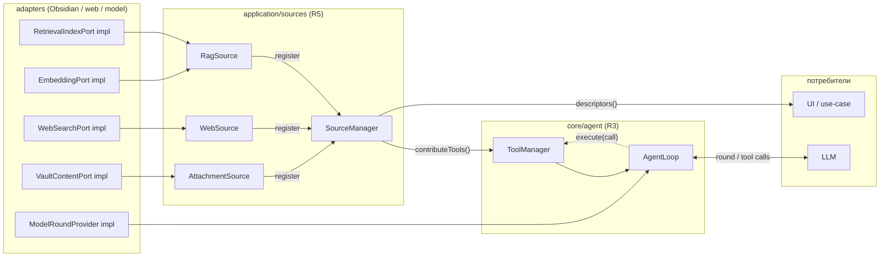

# SPEC: Детальный дизайн модулей Core (стадия 1)

**Статус:** Draft. Дополняет [SPEC-ixplorer-core-extraction.md](./SPEC-ixplorer-core-extraction.md) —
конкретизирует приоритетные требования начального этапа на уровне модулей и интерфейсов.

Главный принцип ниже: **многое уже существует** в `src/research/tools/*`, но под «research»-неймингом
и сцеплено с research-слоем. Стадия 1 — это в основном **обобщение + подъём в core + введение слоя
источников данных**, а не написание с нуля.

Сводка требований и их статус:

| # | Требование | Что есть сейчас | Что делаем |
|---|-----------|-----------------|------------|
| R1 | Контракты разнесены по доменам, рядом с кодом | `shared/types.ts` god-module (766 стр., 84 импортёра) | Разнести (T2) |
| R2 | UI отделён и заменяем | UI тянет доменную модель; домен импортит `ui/rendering` | Развернуть зависимость (T3/T4) |
| R3 | Core: agent loop + универсальный tool-интерфейс + tools manager | `ResearchToolHandler` / `ResearchToolRegistry` / `runToolLoop` | Обобщить и поднять в `core/agent` |
| R4 | Vault-FS инкапсулирован за общим интерфейсом | 4 Obsidian-провайдера, контракты в god-module | Свести в `application/ports`, адаптеры — в `adapters/obsidian` |
| R5 | RAG / web / attachments — подключаемые источники с общим + спец. интерфейсом, + manager | Источники сцеплены внутри `createResearchToolRegistry` | Ввести `DataSource` + `SourceManager` поверх tools |

---

## R1. Контракты по доменам, рядом с кодом

### Намерение
Убрать единый тип-хаб `shared/types.ts`, из-за которого 84 файла зависят от одного файла со всеми
доменами сразу. Контракт должен жить рядом с кодом, который им владеет.

### Целевое разнесение
```
core/model/source.ts        SourceReference*, ExtractedChunk, EmbeddedChunk, RetrievedChunk, SourceKind
core/model/citation.ts      Citation, Evidence
core/conversation/model.ts  ConversationMessage, ConversationCompactionSummary, ReasoningSegment, ChainItem
core/agent/tool.ts          Tool, ToolDefinition, ToolCall, ToolResult, ToolError      (R3)
core/agent/protocol.ts      ChatMessage, ChatRequest, ModelRound*, ModelStreamEvent, ReasoningCapabilities
application/sources/contracts.ts  DataSourceDescriptor, SourceQuery, SourceResult       (R5)
application/ports/*.ts      VaultContentPort, VaultGraphPort, RetrievalIndexPort, …      (R4)
research/diagnostics.ts     весь блок *Diagnostics (потребитель — research + ui)
```

### Правила
- Контракт принадлежит слою, который определяет его **смысл**, а не тому, кто первый его использует.
- Тип, нужный двум модулям одного уровня, поднимается на общий слой ниже (обычно `core/model`),
  но **не** в единый «shared everything».
- На переходный период `shared/types.ts` остаётся barrel-реэкспортом → импортеры мигрируют постепенно,
  затем barrel удаляется.

### Критерий
Ни один модуль не импортирует тип чужого домена «за компанию». Самый частый импорт перестаёт быть
единым файлом на весь проект. → **SPEC задача T2.**

---

## R2. UI отделён и заменяем

### Намерение
UI — это деталь (Obsidian-вью). Должна заменяться на CLI/Hermes/OpenClaw без изменения ядра.
Сейчас направление зависимостей **обратное**: `research`/`chat` импортируют `ChatDisplayMessage` из
`ui/rendering` (нарушение Dependency Rule).

### Целевая граница
```
core/conversation/         ← доменная модель разговора + чистые reducers (без Obsidian, без DOM)
   model.ts                  ConversationMessage, ReasoningSegment, ChainItem, CompactionSummary
   reducers.ts               nextAssistantMessage, nextChain*, finalize* (чистые функции, юнит-тест без UI)
ui/ (apps/obsidian/ui)     ← view-model ПОВЕРХ core-модели + Obsidian-форматтеры
   conversationFormatting.ts formatIndexingStatus, citationTarget, messageMarkdownContent
```

### Контракт между ядром и любым UI
UI получает от application только сериализуемые DTO и поток событий, и отдаёт обратно команды.
Никаких `HTMLElement`/`TFile` через границу. Любой фронтенд (Obsidian-вью, CLI-рендер, web) реализует
один и тот же контракт потребления:
```ts
interface ConversationView {
  render(state: ConversationSnapshot): void;     // ConversationSnapshot — чистый DTO из core
  onUserCommand(handler: (cmd: UserCommand) => void): void;
}
```
`core`/`application` ничего не знают про `ConversationView`; они эмитят `IxplorerEvent` в `ProgressSink`,
а конкретный UI подписывается на него в composition root.

### Критерий
`core`/`application` компилируются без типов obsidian и DOM. Замена UI = новый адаптер, без правок ядра.
→ **SPEC задачи T3, T4.**

---

## R3. Core: agent loop + универсальный tool-интерфейс + tools manager

### Намерение
Ядро содержит цикл агента (model ↔ tools). Все инструменты — за **единым универсальным интерфейсом**,
чтобы список tools легко расширялся. Ядро запрашивает инструменты не напрямую, а через **ToolManager**.

### Что уже есть (переиспользуем, переименовываем)
- `ResearchToolHandler` → `Tool` (универсальный интерфейс: `definition` + `parseInput` + `execute`).
- `ResearchToolRegistry` → `ToolManager` (реестр + политика доступности + диспетчеризация по имени).
- `runToolLoop` → `core/agent/AgentLoop` (state-machine: round → tool calls → execute → продолжить/стоп).

### Целевые интерфейсы (`core/agent/`)
```ts
// Универсальный tool-контракт. Никакой привязки к research/web/vault.
interface Tool<I = unknown, O = unknown> {
  readonly definition: ToolDefinition;                 // имя, описание, JSON-schema параметров
  parseInput(raw: Record<string, unknown>): ParseResult<I>;
  execute(input: I, ctx: ToolContext): Promise<ToolResult<O>>;
}

interface ToolContext {
  callId: string;
  signal: AbortSignal;          // отмена
  emit(event: IxplorerEvent): void;   // прогресс/стриминг наружу
}

// Менеджер, через который ядро ЗАПРАШИВАЕТ инструменты.
interface ToolManager {
  definitions(): ToolDefinition[];                     // что отдать модели в запросе
  has(name: string): boolean;
  execute(call: ToolCall, ctx: ToolContext): Promise<ToolResult>;
  register(tool: Tool, availability?: AvailabilityRule): void;  // расширение списка
}

// Цикл агента зависит ТОЛЬКО от абстракций — модель-порт и tool-manager.
interface AgentLoopDeps {
  model: ModelRoundProvider;     // порт (адаптер реализует chat-completions/responses)
  tools: ToolManager;
  policy: AgentLoopPolicy;       // лимиты раундов, стоп-условия, обработка ошибок tool
}
```

### Размещение и направление зависимостей
- `core/agent` — чистая механика цикла и реестра. Зависит **только** от `core/model` и портов
  (`ModelRoundProvider`). Не знает, что именно делают конкретные инструменты.
- Конкретные tools (RAG/web/note) переезжают из `research/tools` и регистрируются в `ToolManager`
  снаружи (в `application` через `SourceManager`, см. R5), а не внутри ядра.
- **Расширяемость:** добавить инструмент = реализовать `Tool` + `toolManager.register(...)`. Ядро не
  меняется. Это и есть «универсальный интерфейс взаимодействия с tools».

### Открытый вопрос (зафиксировать)
Цикл агента — это «алгоритм ядра» (тогда `core/agent`) или «use case» (тогда `application/use-cases`)?
Рекомендация: **механика цикла — в core** (зависит только от абстракций), а сборка конкретного набора
tools и провайдера модели — в application/composition. Это сохраняет ядро тестируемым на mock-модели.

→ Расширяет **SPEC задачу T8** (порты + развязка `ResearchService`); добавляет переименование/подъём
`tools/*` в `core/agent`.

---

## R4. Vault-FS инкапсулирован за общим интерфейсом

### Намерение
Всё взаимодействие с файловой системой vault — в отдельном модуле-адаптере. Ядру доступен только общий
интерфейс. Сейчас Obsidian уже изолирован за 4 провайдерами — это нужно закрепить и свести контракты в
`application/ports`.

### Что уже есть
`ObsidianVaultFileProvider`, `ObsidianContextFileProvider`, `ObsidianGraphContextProvider`,
`ObsidianVaultWriter` — реализации, прямые импорты `obsidian` сосредоточены здесь.

### Целевые порты (`application/ports/vault.ts`)
```ts
interface VaultContentPort {
  listDocuments(input: ListDocumentsInput): Promise<DocumentSummary[]>;
  readDocument(path: string): Promise<DocumentContent>;   // нормализованный DTO, без TFile
}
interface VaultGraphPort   { getLinks(input: GraphLinksInput): Promise<GraphLinksResult>; }
interface VaultWritePort   { saveDocument(input: SaveDocumentInput): Promise<SavedDocument>; }
interface ActiveDocumentPort { getActiveDocument(): Promise<DocumentSummary | null>; }
```

### Правила инкапсуляции
- Через границу ходят **пути-строки и нормализованные DTO**, никогда `TFile`/`Vault`/`TAbstractFile`.
- Чтение vault, разбор frontmatter/ссылок, доступ к `metadataCache` — целиком внутри `adapters/obsidian`.
- `core`/`application` зависят только от портов; альтернативный рантайм даёт свой адаптер
  (`adapters/filesystem` для прямого fs, `adapters/bridge` для удалённого vault).
- **Подвопрос (из §11 верхнего SPEC):** `graphContext` использует исключительно Obsidian `metadataCache`
  или нужен переносимый parser-fallback в адаптере? Влияет на то, можно ли запускать graph-context без
  Obsidian. Рекомендация: интерфейс `VaultGraphPort` нейтрален; fallback-parser — отдельный адаптер.

### Критерий
Ни одного импорта `obsidian` вне `adapters/obsidian` и `apps/obsidian`. → **SPEC задачи T5, T7** (+ перенос
провайдеров в `adapters/obsidian`).

---

## R5. RAG / web / attachments — подключаемые источники данных

Это самое содержательное требование — проработаю детальнее.

### Намерение
RAG (vault retrieval), web search и явные attachments — это **внешние источники данных** с общим
интерфейсом взаимодействия. У каждого может быть расширенный спец-интерфейс. Они — отдельные
подключаемые модули. Агент работает с ними **через tools**, но дополнительно должен существовать
**SourceManager** для целостного представления о доступных источниках (introspection, политики,
бюджеты, диагностика).

### Два разных контракта — не путать
Ключевое архитектурное различие:

| Путь | Кто потребитель | Назначение |
|------|-----------------|------------|
| **Tool** (R3) | LLM / agent loop | *Действие*: модель вызывает `vault_search`, `web_research`, `read_note` во время раунда |
| **DataSource** (R5) | Application / composition | *Регистрация и интроспекция*: какие источники включены, их capabilities, бюджеты, доступность |

Они **композируются**: каждый `DataSource` умеет отдавать свои `Tool`-handlers, которые `SourceManager`
регистрирует в `ToolManager`. То есть `SourceManager` — фабрика и реестр источников; `ToolManager` —
рантайм-диспетчер вызовов модели. `createResearchToolRegistry` сегодня делает это «вручную и слитно» —
разносим на два явных слоя.

### Общий интерфейс источника (`application/sources/contracts.ts`)
```ts
type SourceKind = "rag" | "web" | "attachments";

interface DataSourceDescriptor {        // «общее представление» для SourceManager
  id: string;
  kind: SourceKind;
  title: string;
  available: boolean;
  capabilities: SourceCapabilities;     // что умеет (см. ниже)
  unavailableReason?: string;
}

interface DataSource {
  readonly descriptor: DataSourceDescriptor;
  tools(): Tool[];                       // вклад источника в agent loop
  // опционально: прямой программный доступ (не через LLM) для UI/preview
}
```

### Расширенные интерфейсы (спец. для каждого источника)
Базовый `DataSource` даёт общее; для богатых сценариев — расширения, которые UI/use-case могут запросить
через `SourceManager` по `kind`:
```ts
interface RetrievalSource extends DataSource {       // RAG
  search(q: RetrievalQuery): Promise<RetrievalResult>;
  adjacent(i: AdjacentInput): Promise<RetrievedChunk[]>;
  languageInventory(): Promise<LanguageInventoryItem[]>;
}
interface WebSource extends DataSource {             // web
  search(q: WebSearchQuery): Promise<WebSearchResult>;
  fetch(url: string, opts?: WebPageFetchOptions): Promise<WebPageFetchResult>;
}
interface AttachmentSource extends DataSource {      // explicit attachments
  list(): Promise<DocumentSummary[]>;
  read(ref: AttachmentRef): Promise<DocumentContent>;
}
```

### SourceManager (`application/sources/SourceManager.ts`)
```ts
interface SourceManager {
  register(source: DataSource): void;                  // подключение модуля-источника
  descriptors(): DataSourceDescriptor[];               // целостное представление о доступном
  get<T extends DataSource>(id: string): T | undefined;
  byKind<T extends DataSource>(kind: SourceKind): T[];
  contributeTools(into: ToolManager): void;            // мост R5 → R3: все tools источников в loop
}
```
### Диаграмма композиции

Композиция собирается в composition root; стрелки = направление вызова/зависимости. Слева направо:
адаптеры реализуют порты → источники оборачивают порты в `DataSource` → `SourceManager` отдаёт их tools
в `ToolManager` → `AgentLoop` дёргает модель и инструменты. Все стрелки исходного кода направлены к
`core`/`application`.



Два пути из таблицы выше видны явно: **сплошные** `register`/`contributeTools` — путь регистрации
(`DataSource` → `SourceManager` → `ToolManager`); **пунктирный** `execute(call)` — рантайм-путь вызова
инструмента моделью во время раунда `AgentLoop`. `descriptors()` — отдельная ветка интроспекции в UI,
не проходящая через agent loop.

### Подключаемость (pluggable)
- Каждый источник — отдельный модуль `application/sources/rag|web|attachments/`, зависит только от своих
  портов (`RetrievalIndexPort`, `WebSearchPort`, `VaultContentPort`).
- Включение/выключение источника = `register` или нет (управляется настройками в composition root).
  Это заменяет текущую `availability`-матрицу в `createResearchToolRegistry` на явную композицию.
- Новый источник (например, локальная БД, Zotero, внешний API) = новый модуль, реализующий `DataSource`,
  без изменений в ядре и в других источниках.

### Открытые вопросы (из §11 верхнего SPEC — здесь конкретизированы)
- `vault_search` (RAG-tool): полный hybrid retrieval внутри источника, или поиск по готовому индексу?
  → определяет, что внутри `RetrievalSource.search`.
- `web_research`: остаётся Ixplorer-источником или делегируется встроенному инструменту harness?
  → влияет на то, регистрируем ли `WebSource` после интеграции.
- attachments: общий бюджет токенов источников держит `SourceManager` или вызывающий use-case?
  Рекомендация: бюджет/политика — в use-case (context assembly), источник отдаёт сырые данные.

→ Расширяет **SPEC задачи T5, T8**; вводит новый слой `application/sources/*`.

---

## Итоговое размещение (как ложится на структуру верхнего SPEC)

```
core/
  model/            R1   source, citation, evidence
  conversation/     R2   модель разговора + чистые reducers
  agent/            R3   Tool, ToolManager, AgentLoop, protocol
application/
  ports/            R4   VaultContent/Graph/Write/ActiveDocument, RetrievalIndex, Web, Embedding
  sources/          R5   DataSource, SourceManager, rag/ web/ attachments/
  use-cases/             vault-search, read-note, graph-context, retrieve-adjacent, web-research, save-answer
  contracts/        R1   boundary DTO
adapters/
  obsidian/         R4   реализации vault-портов (перенос 4 провайдеров)
  filesystem/            index + chat persistence
  model-provider/        LLM/embedding клиенты
  web/                   DuckDuckGo как WebSearchPort
apps/obsidian/      R2   main.ts (composition root), ui/, settings/
```

## Влияние на backlog верхнего SPEC
- **T2** покрывает R1.
- **T3/T4** покрывают R2.
- **R3** добавляет шаг: «обобщить `tools/*` → `core/agent` (`Tool`/`ToolManager`/`AgentLoop`)» — встроить
  рядом с T8.
- **R4** покрывается T5+T7 плюс физический перенос провайдеров в `adapters/obsidian`.
- **R5** добавляет новый слой `application/sources/*` — отдельная задача, зависит от T5 (порты) и
  обобщённого ToolManager из R3.

Рекомендуемый порядок с учётом приоритетов пользователя: **T2 (R1) → T3/T4 (R2) → R3 (обобщить tools) →
T5/R4 (порты vault) → R5 (источники) → T7 (composition)**.
