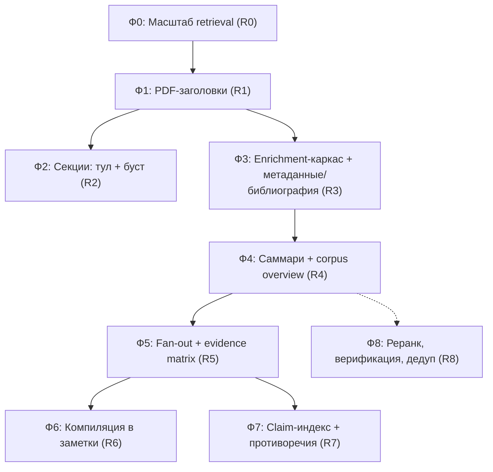

# SPEC: Корпусный анализ — работа с большими наборами PDF

**Статус:** Draft.
**Сценарий-драйвер:** 50 PDF × ~100 страниц (статьи/книги). Задачи пользователя: сравнение
документов, компиляция знаний в связный граф (vault-заметки), поиск противоречащих фактов,
поиск общих источников (цитируемой литературы).
**Контекст:** текущий retrieval уже переведён на BM25 + гибрид с эмбеддингами; деградация
семантики видима (warning в отчёте + бейдж в UI). Этот SPEC описывает следующий слой —
знания о документах как о целых, а не только о чанках.

Сводка требований:

| # | Требование | Что есть сейчас | Что делаем |
|---|-----------|-----------------|------------|
| R0 | Поиск работает на 50–100 тыс. чанков | Полное чтение постингов с диска на каждый запрос; brute-force по векторам в JS-объектах | Кэш keyword-индекса, предвычисленные длины, Float32Array |
| R1 | PDF-чанки имеют `headingPath` | `headingPath` только у markdown; PDF — только `pageNumber` | Извлечение заголовков: PDF outline + эвристика по шрифтам |
| R2 | Section-aware retrieval | `read_index_chunk before/after` (агент угадывает границы) | Тул `read_index_section`, буст заголовков в BM25 |
| R3 | Библиографический слой | `list_index_urls` (только URL) | Метаданные документа + список литературы + граф цитирования |
| R4 | Обзор корпуса | `<index-description>` с 12 репрезентативными чанками | Иерархические саммари (секция → документ → корпус) |
| R5 | Fan-out по документам | `run_subagent` (одиночный) | Map-reduce: вопрос × N источников, evidence matrix |
| R6 | Компиляция знаний в vault | `create_note`/`update_note` + action-honesty | Workflow «compile to notes» с `[[wikilinks]]` |
| R7 | Поиск противоречий | — | Claim-индекс + `find_claims`, судья — LLM над предотобранными парами |
| R8 | Качество на масштабе | `unknownCitationIds` | Реранкинг top-k, цитатная верификация, дедуп чанков |

Зависимости: R1 → R2 (буст) и R4 (секционные саммари); R0 — фундамент всего;
R3+R4 делаются одним «enrichment»-проходом индексации; R7 опирается на R5.

---

## R0. Масштаб retrieval

### Намерение
На 4 источниках (2842 чанка) задержки незаметны. На 50×100 стр (~40–70 тыс. чанков)
текущая реализация деградирует линейно на каждый вызов `search_index`.

### Проблемы в текущем коде
1. `searchFileVectorKeywords` ([FileVectorIndexQuery.ts](../src/adapters/indexing/store/FileVectorIndexQuery.ts))
   на **каждый запрос** читает с диска все `keywords/<shard>.terms.jsonl` и мёржит
   (`mergeKeywordPostingRows`) — O(словарь корпуса) диска и CPU на запрос.
2. BM25 (`rankKeywordPostings`) на каждый запрос пересчитывает длины всех чанков
   из постингов — O(суммы постингов).
3. `queryFileVectorState` — скалярное произведение по всем чанкам, эмбеддинги
   хранятся как `number[]` (boxed doubles).

### Целевое устройство
- **Кэш keyword-состояния.** Merged-постинги + `Map<chunkId, length>` + `avgLength`
  вычисляются один раз при загрузке состояния и живут в `FileVectorIndexState`
  (инвалидация — вместе с ним же: state уже пересоздаётся при коммите индекса).
  Формат файлов не меняется, переиндексация не нужна.
- **Term-lookup вместо линейного скана.** Постинги в кэше — `Map<term, Posting[]>`;
  `rankKeywordPostings` получает вместо `rows: KeywordPostingRow[]` интерфейс
  `KeywordPostingLookup { get(term): Posting[] | undefined; stats: { chunkCount; avgLength; lengthOf(chunkId) } }`.
  Существующая сигнатура остаётся тонким адаптером для тестов.
- **Векторы — `Float32Array`.** При загрузке шардов эмбеддинги складываются в один
  непрерывный `Float32Array` на шард; `dotProduct` работает по срезам. ANN (HNSW и т.п.)
  сознательно **не** делаем: brute-force по float32 на 100 тыс. × 768 — десятки мс, достаточно.

### Критерий приёмки
`search_index` на синтетическом индексе 50 тыс. чанков — p50 < 150 мс (без сети/эмбеддинга),
повторный запрос не читает диск (проверяется фейковым fs в тесте).

---

## R1. Извлечение заголовков из PDF

### Намерение
`headingPath` у PDF-чанков — разблокирующий шаг для секций (R2), секционных саммари (R4)
и осмысленного `get_index_source_outline` по книгам/статьям.

### Источники заголовков (по убыванию доверия)
1. **PDF outline (bookmarks).** `pdfjs` даёт `document.getOutline()` → дерево
   `{title, dest, items[]}`; `getDestination`/`getPageIndex` резолвят пункт в страницу.
   Если outline есть и покрывает документ (≥3 пунктов) — используется он.
2. **Эвристика по типографике.** Для PDF без outline: `getTextContent()` возвращает
   у item'ов `transform` (масштаб = размер шрифта) и `fontName`. Строка — кандидат
   в заголовок, если: размер шрифта > медианного по документу × 1.15, длина < 120 симв.,
   не оканчивается точкой/запятой, и/или ВЕСЬ КАПС при длине < 80. Уровень заголовка —
   по кластерам размеров (2–3 кластера максимум, глубже не пытаемся).
3. **Fallback.** Ничего не нашли — `headingPath` пустой, поведение как сейчас.

### Изменения по слоям
- `core/model`: `PdfSourceReference` получает `headingPath?: string[]` (опционально —
  старые индексы валидны).
- `adapters/extractors/PdfExtractor.ts`:
  - `PdfTextContentItem` расширяется (`height`/`transform`, `fontName`) — только для
    pdfjs-парсера; `SimplePdfTextParser` заголовки не извлекает (fallback-путь).
  - Новый leaf-модуль `adapters/extractors/pdfHeadings.ts`: чистые функции
    `headingsFromOutline(outline, pageIndex)` и `headingsFromTypography(pages)` →
    `PdfHeading[] { title, level, pageNumber, offsetInPage }`.
  - `chunkPdfPage` получает текущий `headingPath` (заголовки сортированы по
    (page, offset); чанк наследует путь последнего заголовка перед ним).
  - `PdfTextCache`: версия формата кэша повышается (в кэш добавляются метрики
    шрифтов/заголовки), старые записи инвалидируются по версии.
- `adapters/indexing`: `algorithmVersion` манифеста +1 → существующие индексы
  помечаются на пересборку штатным механизмом `rebuild-required`.
- `outlineSections` ([FileVectorIndexInventory.ts](../src/adapters/indexing/inventory/FileVectorIndexInventory.ts))
  перестаёт быть markdown-only: берёт `headingPath` из любого source, где он есть.

### Критерий приёмки
Для «The Fairy Tales of Charles Perrault.pdf» `get_index_source_outline` возвращает
список сказок (включая «Riquet with the Tuft», chunkStart ≈ 113). Юнит-тесты эвристики
на синтетических страницах (капс-заголовок, крупный шрифт, ложные срабатывания на
колонтитулах — колонтитул отсекается повторяемостью на >30% страниц).

### Риски
Типографика в «грязных» PDF (сканы, двухколоночная вёрстка) даст мусорные заголовки.
Смягчение: заголовок принимается только если делит документ на секции разумного размера
(медиана секции ≥ 2 чанков); иначе уровень отбрасывается целиком.

---

## R2. Section-aware retrieval

### R2a. Тул `read_index_section`
- Вход: `chunkId`, опционально `maxChars` (по умолчанию 20 000), `cursor`.
- Семантика: вернуть все чанки секции, которой принадлежит `chunkId`, по порядку
  `chunkIndex`, каждый со своим `evidenceId` (регистрация в `EvidenceRegistry`,
  как у `read_index_chunk`).
- Граница секции: одинаковый непустой `headingPath` (после R1 работает и для PDF);
  при пустом `headingPath` — непрерывный ран того же `sourcePath`, ограниченный
  «титульными» чанками (эвристика: чанк < 100 симв.). Всегда жёсткий кап `maxChars`
  + курсор для продолжения.
- Размещение: логика границ — чистая функция в `adapters/indexing/inventory`
  (рядом с `outlineSections`), тул — `adapters/research-tools/index`, порт-метод
  в `ResearchRetriever`.
- Промпт (`core/research/agenticPrompts`): «если топ-результат похож на заголовок
  или обрывок — прочитай секцию целиком через read_index_section, а не собирай её
  по чанкам».

### R2b. Буст заголовков в ранжировании (после R1)
- Формат keyword-индекса v2: постинг получает второе поле —
  `{chunkId, frequency, headingFrequency}` (частота терма в `headingPath`+`title` чанка).
- Скоринг — упрощённый BM25F: `tf_effective = frequency + HEADING_WEIGHT × headingFrequency`
  (стартовое `HEADING_WEIGHT = 3`), дальше обычный BM25. Один параметр, без отдельной
  нормализации полей — сознательное упрощение.
- Миграция: версия в `KeywordIndexManifest`; индекс без поля читается со старым скорингом.

### Критерий приёмки
Запрос «Riquet with the Tuft» с пустым sourcePath возвращает секцию сказки в топ-1
и `read_index_section` отдаёт её целиком за ≤ 2 вызова. Характеристический тест
на порядок выдачи до/после буста.

---

## R3. Библиографический слой

### Намерение
«Общие источники» между статьями — детерминированная операция над извлечённой
библиографией, LLM нужен один раз при индексации.

### Данные
Sidecar в папке индекса: `metadata/<sourceId>.json`
```jsonc
{
  "schemaVersion": 1,
  "sourcePath": "...", "contentHash": "...",       // инкрементальность
  "title": "...", "authors": ["..."], "year": 2024,
  "abstract": "...",
  "references": [{
    "raw": "Smith J. et al. ...",                   // исходная строка
    "normalized": { "title": "...", "year": 2020, "doi": "10..../..." } // best-effort
  }],
  "extraction": { "model": "...", "promptVersion": 1 }
}
```
- Извлечение: LLM-проход по первым ~3 страницам (титул/аннотация) + секции
  «References/Bibliography/Список литературы» (находится по заголовкам из R1 или
  по регэкспу). Нормализация ссылок: DOI-регэксп детерминированно; сопоставление
  без DOI — по нормализованному названию (нижний регистр, без пунктуации) + год.
- Порты: `DocumentMetadataStore` (read/write sidecar) в `application/ports`,
  извлечение — use-case `EnrichIndexSources` в `application`, LLM и fs — через
  существующие порты. Запускается после коммита индексации, инкрементально по
  `contentHash`, с прогрессом и отменой.

### Инструменты
- `get_source_metadata(sourcePath)` — карточка документа.
- `list_shared_references({minSources: 2})` — ссылки, встречающиеся в ≥ N документах,
  с перечнем цитирующих (это и есть «общие источники»).
- Фильтры `search_index`: `year`, `author` (по метаданным → `sourcePaths`, тем же
  механизмом, что языковой скоуп в `RetrievalService.resolveLanguageScope`).

### Критерий приёмки
На корпусе из 5+ статей с пересекающейся библиографией `list_shared_references`
возвращает хотя бы одну общую работу с ≥ 2 цитирующими документами; повторный запуск
enrichment не вызывает LLM для неизменённых источников.

---

## R4. Иерархические саммари

### Намерение
Обзорные вопросы («что корпус говорит об X», «сравни подходы») не решаются top-k
чанков. 50 однострочных саммари документов помещаются в системный промпт целиком;
секционные саммари дают агенту дешёвую навигацию вглубь.

### Данные
Sidecar `summaries/<sourceId>.json`:
```jsonc
{
  "schemaVersion": 1, "contentHash": "...",
  "sections": [{ "headingPath": ["..."], "chunkStart": 10, "chunkEnd": 24, "summary": "..." }],
  "document": { "summary": "...", "oneLiner": "..." },
  "generation": { "model": "...", "promptVersion": 1 }
}
```
- Map-reduce: секция (границы из R1/R2) → саммари ~50–100 слов; документ — из
  секционных саммари → ~150 слов + one-liner. Тот же `EnrichIndexSources`-проход,
  что R3 (один прогон LLM-очереди, две задачи).
- Стоимость: ~50 док × (10–20 секций + 1) вызовов дешёвой модели, инкрементально.

### Потребители
- `<index-description>`: вместо «Representative sources» — список документов с
  one-liner'ами (кап по токенам, приоритет — недавно изменённые).
- Тул `get_source_summary(sourcePath)` → документное + секционные саммари.
- Промпт-стратегия: «для обзорных вопросов сначала прочитай саммари документов,
  выбери релевантные, затем углубляйся search_index/read_index_section с sourcePath».

### Критерий приёмки
Вопрос «какие темы покрывает корпус» отвечается без единого `search_index`
(по саммари), с корректным перечислением ≥ 80% документов.

---

## R5. Fan-out по документам (map-reduce sub-agents)

### Намерение
«Позиция каждого документа по вопросу X» — это N независимых суб-задач, а не один
поиск. База уже есть: `SubAgentRunner` + `run_subagent`.

### Целевое устройство
- Тул `map_sources({question, sourcePaths?, maxSources, perSourceBudget})`:
  для каждого источника запускается sub-agent с инструкцией и жёстким скоупом
  (`search_index`/`read_index_section` с фиксированным `sourcePath`), результат —
  структурированная запись `{sourcePath, stance, keyFindings[], evidenceIds[]}`.
- Батчирование: параллельно ≤ 3–5 sub-agents, общий бюджет токенов/времени,
  отмена по `signal`. Выбор источников по умолчанию — через саммари (R4): сначала
  дешёвый отбор релевантных документов, fan-out только по ним.
- **Evidence matrix** — формат ответа reduce-шага: таблица документ × позиция
  с цитатами `[evidenceId]`. Это основной UX сравнения и вход для R7.

### Критерий приёмки
Вопрос-сравнение по 10 документам даёт таблицу с ≥ 1 цитатой на строку,
время ≤ ~3× одиночного глубокого запроса, деградация одного sub-agent не валит прогон.

---

## R6. Компиляция знаний в vault-заметки

### Намерение
«Общий массив знаний (граф)» материализуется как сеть заметок Obsidian —
graph view, backlinks и переиспользование индексации получаются бесплатно.

### Целевое устройство
- Workflow (промпт-скилл поверх существующих тулов, без новых портов):
  «скомпилируй знания корпуса по теме X в папку Y»:
  1) R4-саммари → план заметок (сущности/подтемы);
  2) на каждую заметку — исследование (R5-fan-out при необходимости);
  3) `create_note`/`update_note`: заметка с `[[wikilinks]]` на соседние
     и цитатами `[evidenceId]` (+ человекочитаемая сноска: файл, страница);
  4) дедуп против существующих: `search_notes` перед созданием, при совпадении —
     append-секция, не перезапись (действующие note mutation rules).
- Индексный профиль поверх папки Y превращает скомпилированное в искомый слой
  для link-graph expansion.

### Критерий приёмки
Прогон по теме на тестовом корпусе создаёт ≥ 5 связанных заметок; каждая фактическая
клейма имеет цитату; повторный прогон не дублирует заметки.

---

## R7. Claim-индекс и поиск противоречий

### Намерение
Автоматическая детекция противоречий по всему корпусу «в лоб» ненадёжна. Двухслойная
схема: дешёвое извлечение утверждений при индексации + LLM-судья только над
предотобранными группами.

### Данные
Sidecar `claims/<sourceId>.jsonl`, строка:
```jsonc
{ "claimId": "...", "chunkId": "...", "sourcePath": "...",
  "subject": "нормализованная сущность/тема", "statement": "утверждение одним предложением",
  "topicKeys": ["privacy.mail-forwarding", "..."] }
```
- Извлечение — третьей задачей enrichment-прохода (R3/R4), только из «содержательных»
  секций (не references). `topicKeys` — свободная нормализация LLM + лемматизированный
  `subject`; точная онтология не строится.
### Инструменты
- `find_claims({topic | subject, limit})` → группы утверждений разных документов
  об одном subject, с `chunkId` для дословной проверки.
- Workflow «найди противоречия по теме X»: `find_claims` → LLM-судья по парам
  внутри группы → отчёт «A утверждает…, B утверждает…» с обеими цитатами,
  проверенными через `read_index_chunk`.

### Критерий приёмки
На синтетической паре документов с заложенным противоречием workflow находит его
и цитирует оба чанка; ложноположительные на перефразировках одного факта — не более
допустимого (фиксируется тестовым набором из ~20 пар).

### Риски
Самая дорогая и наименее предсказуемая часть SPEC. Делается последней; evidence
matrix (R5) покрывает 70% ценности «найди противоречия» вручную-наводимым способом.

---

## R8. Качество на масштабе

- **Реранкинг top-k.** Кандидаты BM25+вектор (top-20..50) → LLM-реранк дешёвой моделью
  (относительная сортировка, не скоринг) → top-5. Включается флагом профиля; в
  диагностику — `rerank`-блок (вход/выход/латентность).
- **Цитатная верификация.** Пост-шаг ответа: для каждого `[evidenceId]` проверить,
  что заявленная рядом цитата/факт лексически пересекается с текстом чанка
  (shingle overlap ≥ порога). Несоответствия — в `unknownCitationIds`-подобный блок
  `unverifiedCitations` + warning. Детерминированно, без LLM.
- **Дедуп чанков.** При индексации — minhash/шинглы (k=8) → кластеры near-duplicate
  между источниками; в выдаче дубль подавляется (оставляется лучший скор) с пометкой
  `duplicates: [sourcePath...]`. Критично для R7 (иначе «противоречия» между копиями
  одной статьи).

---

# План реализации

**Инвариант каждой фазы** (по [AGENTS.md](../AGENTS.md)): `npx tsc --noEmit`,
`npm run depcruise` (0 errors), `npm test`, `npm run build` — зелёные; новые внешние
зависимости — только через порты; файлы ≤ ~400 строк; характеристические тесты перед
изменением потока исполнения.



### Ф0 — Масштаб retrieval (маленькая, без миграций)
1. Кэш merged-постингов + длины/avgLength в `FileVectorIndexState`; интерфейс
   `KeywordPostingLookup`; `rankKeywordPostings` поверх lookup.
2. `Float32Array` для эмбеддингов шардов.
3. Бенчмарк-тест на синтетическом индексе (50 тыс. чанков) с бюджетом времени.

### Ф1 — PDF-заголовки (средняя; bump `algorithmVersion`, требует переиндексации)
1. `PdfHeading`-модель + `pdfHeadings.ts` (outline-путь) + юнит-тесты.
2. Типографическая эвристика + анти-колонтитульный фильтр + тесты.
3. `headingPath` в `PdfSourceReference`, прокладка через `chunkPdfPage`,
   версия `PdfTextCache`, `algorithmVersion` +1.
4. `outlineSections` — source-agnostic; проверка на книге Перро.

### Ф2 — Секции (средняя)
1. Чистая функция границ секции + `read_index_section`: порт → адаптер-тул →
   регистрация в `RagSource` → промпт-подсказка. Тесты: markdown-секция,
   PDF-секция, кап/курсор.
2. Keyword-формат v2 (`headingFrequency`) + BM25F-скоринг + миграционное чтение v1.
3. Характеристические тесты ранжирования до/после.

### Ф3 — Enrichment-каркас + библиография (крупная)
1. Порты: `DocumentMetadataStore`, `EnrichmentTaskRunner` (очередь с прогрессом,
   отменой, инкрементальностью по `contentHash`); UI-статус в настройках индекса.
2. Извлечение метаданных/references (LLM-промпт версионируется), нормализация ссылок.
3. Тулы `get_source_metadata`, `list_shared_references`; фильтры year/author.
4. Диагностика enrichment в отчёт (сколько источников, стоимость, ошибки).

### Ф4 — Саммари (средняя, на каркасе Ф3)
1. Секционные + документные саммари как вторая enrichment-задача.
2. `<index-description>` v2 с one-liner'ами; `get_source_summary`; промпт-стратегия
   обзорных вопросов.

### Ф5 — Fan-out (средняя)
1. `map_sources` поверх `SubAgentRunner`: батчирование, бюджеты, structured output.
2. Reduce-шаблон evidence matrix в промпте; диагностика fan-out в отчёт.

### Ф6 — Компиляция в заметки (промпт-инженерия + UX, код минимален)
1. Скилл/шаблон workflow; дедуп через `search_notes`; сноски-цитаты.
2. Ручная приёмка на тестовом корпусе + чек-лист action-honesty.

### Ф7 — Claims (крупная, последняя)
1. Извлечение claims (третья enrichment-задача) + `claims/*.jsonl`.
2. `find_claims` + workflow противоречий + тестовый набор пар.

### Ф8 — Качество (независимые задачи, вперемешку с Ф4–Ф7)
1. Дедуп чанков (нужен до Ф7).
2. Цитатная верификация (нужна до Ф6).
3. LLM-реранк за флагом профиля.

### Явно вне скоупа
- ANN-индексы (HNSW) — brute-force по float32 достаточно до ~100 тыс. чанков.
- Отдельная графовая БД/визуализация (граф материализуется заметками, R6).
- Строгая онтология сущностей для claims — только свободные `topicKeys`.
