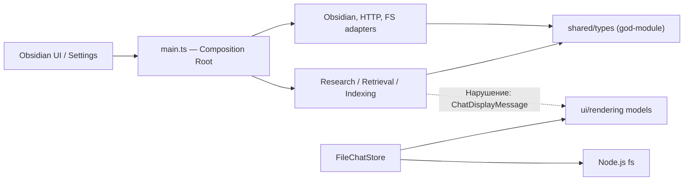
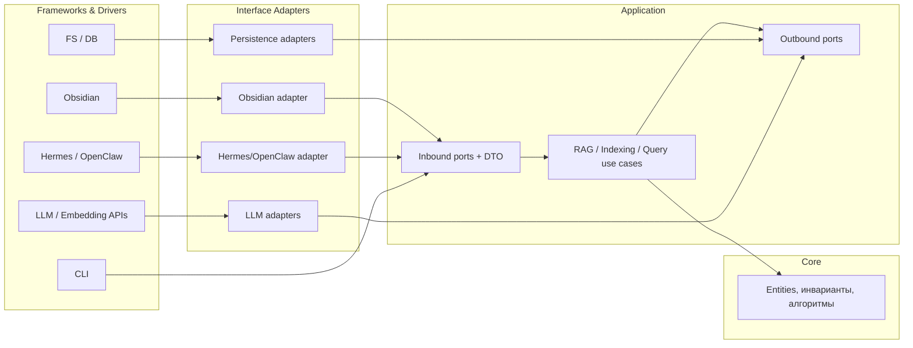

# SPEC: Отделение Ixplorer Core (платформенно-независимое ядро)

**Статус:** Draft. Топологические/runtime-решения согласованы (§11). Фокус сужен: единственная реальная
цель — **платформенно-независимое ядро Ixplorer**. Интеграция с Hermes/OpenClaw — теоретический ориентир,
на данном этапе **не реализуется и не проектируется детально**.
**Объединяет:** ранний Clean-Architecture review + draft-спецификацию из `docs/convesation.log`
и низкоуровневый decoupling-анализ (бывший `architecture-refactoring-proposal.md`, теперь поглощён этим
документом). Все конкретные задачи decoupling переформулированы как шаги стадии 1.

**Детализация модулей:** [SPEC-core-module-design.md](./SPEC-core-module-design.md) — проработка
приоритетных требований начального этапа (контракты по доменам, отделение UI, agent loop + ToolManager,
инкапсуляция vault-FS, источники данных RAG/web/attachments) на уровне интерфейсов.

---

## 1. Цель

Выделить платформенно-независимое ядро Ixplorer, чтобы логика RAG, индексирования, сбора контекста и
генерации запросов **не зависела от Obsidian/Electron** — ради тестируемости, чистых границ модулей и
сохранения опции переписать ядро на другом языке. Переиспользование в другом runtime (Hermes/OpenClaw,
CLI) — желательное следствие, но **не самоцель этапа** и не управляет дизайном напрямую.

Obsidian остаётся **внешним адаптером** для: чтения/записи vault, активной заметки, `metadataCache`,
UI/уведомлений/выбора файлов, запуска и конфигурации приложения.

**Критерий-маяк:** любой сценарий Ixplorer запускается в unit-тесте без пакета `obsidian`, DOM, Electron
и реального filesystem.

### Согласованные решения (топология/runtime)
- **Индекс живёт в vault** (внутри Obsidian-плагина), не в стороннем процессе. Формат индекса не меняется.
- **Obsidian — владелец чтения, графа и записи vault.** Любой будущий runtime отвечал бы только за
  orchestration, но на данном этапе единственный потребитель ядра — сам плагин.
- **Obsidian Mobile не поддерживается** — топология рассчитана на desktop (Node/Electron) c прямым fs.
- **Hermes/OpenClaw сейчас не поддерживаются** — это теоретизация. Никакого bridge-транспорта,
  runtime-адаптеров или `integrations/*` в рамках этапа не строим; см. §8.

### Допущения
- Текущий Obsidian-плагин продолжает работать автономно (standalone сохраняется) — это и есть основной
  и единственный рантайм этапа.
- `ChatModelClient`, `ToolLoopRunner`, compaction, skill registry **не удаляются**; они помещаются за
  заменяемыми портами/абстракциями ради чистоты границ, а не ради передачи их harness.
- Контракты проектируются JSON-совместимыми и версионируемыми — недорогая страховка на будущее, не
  требующая немедленной реализации bridge.

---

## 2. Принципы (Clean Architecture)

- **Dependency Rule:** зависимости направлены строго внутрь — `apps → adapters → application → core`.
  Внутренние слои ничего не знают о внешних.
- **DIP:** порты (интерфейсы) объявляются в `application`, реализуются в `adapters`. Связывание
  объектов — только в composition root (`apps/obsidian/main.ts`), без `new` внешних сервисов в ядре.
- **DTO на границах:** между слоями ходят только сериализуемые структуры (без `TFile`, `Vault`,
  `HTMLElement`, `Response`; `Date`/`Map`/`Set` не пересекают внешнюю границу).
- **Тестируемость:** каждый use case тестируется на in-memory портах.

### Текущая связность (есть нарушения)


### Целевая связность


Запрещено: `core/application ─X─> obsidian, ui, settings, fs, DOM, harness SDK`; `core ─X─> adapters`.

---

## 3. Целевая структура каталогов

Физическое перемещение всех файлов сразу не требуется — сначала контракты и правила импортов, затем
инкрементальный перенос.

```
src/
  core/
    model/        # SourceReference, ExtractedChunk, EmbeddedChunk, RetrievedChunk, Evidence, Citation
    conversation/ # ConversationMessage, ConversationCompactionSummary, ReasoningSegment, ChainItem + чистые reducers
    errors/       # стабильные коды ошибок (IxplorerError)
    retrieval/    # ranking, filtering, query policies
    context/      # context budgets, graph policies
  application/
    contracts/    # JSON-совместимые input/output DTO + диагностика
    ports/        # outbound интерфейсы (см. §6)
    use-cases/    # vault-search, read-note, graph-context, retrieve-adjacent, web-research, save-answer
    events/       # progress / streaming события
  adapters/
    obsidian/     # vault, metadataCache, активная заметка, writer
    filesystem/   # vector index + chat persistence
    model-provider/ # текущие LLM/embedding клиенты (ChatModelClient и т.д.)
    web/          # DuckDuckGo
    legacy-agent/ # фасад над ToolLoopRunner
  apps/
    obsidian/     # main.ts (composition root), ui/, settings/
```
Каталоги `integrations/` (Hermes/OpenClaw) и `adapters/bridge/` **не создаются** — внешний runtime вне
объёма (§8). `legacy-agent/` существует как фасад над `ToolLoopRunner` ради чистой границы, а не ради
будущей передачи harness.

---

## 4. Application API (платформенно-независимый фасад)

```ts
interface IxplorerApplication {
  vaultSearch(input: VaultSearchInput): Promise<ToolResult<VaultSearchResult>>;
  readNote(input: ReadNoteInput): Promise<ToolResult<ReadNoteResult>>;
  graphContext(input: GraphContextInput): Promise<ToolResult<GraphContextResult>>;
  retrieveAdjacent(input: RetrieveAdjacentInput): Promise<ToolResult<RetrieveAdjacentResult>>;
  webResearch(input: WebResearchInput): Promise<ToolResult<WebResearchResult>>;
  saveAnswer(input: SaveAnswerInput): Promise<ToolResult<SaveAnswerResult>>;
}

type ToolResult<T> =
  | { ok: true; data: T; diagnostics?: ToolDiagnostic[] }
  | { ok: false; error: { code: string; message: string; retryable: boolean; details?: unknown } };
```
Входы/выходы: сериализуемые в JSON, версионируемые, без ссылок на конкретные сервис-классы,
валидируемые на внешней границе.

---

## 5. Outbound ports (предварительный набор)

```ts
interface VaultContentPort { listDocuments(i: ListDocumentsInput): Promise<DocumentSummary[]>;
                             readDocument(path: string): Promise<DocumentContent>; }
interface VaultGraphPort   { getLinks(i: GraphLinksInput): Promise<GraphLinksResult>; }
interface VaultWritePort   { saveDocument(i: SaveDocumentInput): Promise<SavedDocument>; }
interface ActiveDocumentPort { getActiveDocument(): Promise<DocumentSummary | null>; }
interface RetrievalIndexPort { search(i: RetrievalInput): Promise<RetrievalResult>;
                               adjacent(i: AdjacentInput): Promise<RetrievedChunk[]>; }
interface EmbeddingPort    { embed(i: EmbeddingInput): Promise<EmbeddingResult>; }
interface WebSearchPort    { search(i: WebSearchInput): Promise<WebSearchResult>; }
interface ChatRepositoryPort { list(): Promise<ChatSummary[]>; load(id): Promise<SavedChat>;
                               save(i): Promise<SavedChat>; rename(id, t): Promise<void>; delete(id): Promise<void>; }
interface ProgressSink     { emit(event: IxplorerEvent): void; }
```
Порты принадлежат `application`; Obsidian/FS/web/LLM их реализуют.

---

## 6. Стадия 1 — задачи (объединённый decoupling + Clean Architecture)

Порядок учитывает зависимости между шагами. Каждый шаг = отдельный коммит, проходящий
`npm test` + `tsc --noEmit`.

| # | Задача | Источник (review) | Эффект | Риск |
|---|--------|-------------------|--------|------|
| **T1** | **Архитектурный quality-gate.** Тест направления импортов (`dependency-cruiser` или кастомный), фиксирующий разрешённые направления §2. Сначала в режиме предупреждений по текущим нарушениям. | Замечание №4 | 🔴 фиксирует границы | низкий |
| **T2** | **Разнести `shared/types.ts` (766 стр., 84 импортёра) по доменам.** `core/model`, `client/chat protocol`, `indexing/retrieval/web contracts`, `research/diagnostics`, `research/answer`. Barrel-реэкспорт на переходный период. | Decoupling П.1 | 🔴 убирает god-module | низкий (механика) |
| **T3** | **Вынести модель разговора из `ui` в `core/conversation`.** `ChatDisplayMessage→ConversationMessage`, `ConversationCompactionSummary`, reasoning-сегменты, `ChainItem` + чистые reducers. `research`/`chat`/`ui` импортируют из core. | Замечание №1 + Decoupling П.2 | 🔴 главное нарушение Dependency Rule | средний |
| **T4** | **Разделить `ui/rendering.ts`.** Чистые reducers → `core/conversation`; Obsidian-форматтеры → `ui/conversationFormatting`. Закрывает T3. | Decoupling П.3 | 🟠 | низкий |
| **T5** | **Boundary DTO в `application/contracts`.** Перенести `RetrievalResult` и прочие boundary-типы из `research/types.ts` (сейчас тянет конкретный `RetrievalService`); убрать ссылки на конкретные сервисы из публичных параметров. | Замечание №2 | 🟠 разблокирует сборку ядра отдельно | средний |
| **T6** | **`ChatRepository` порт + `FileChatRepository` адаптер.** Разделить `FileChatStore` на: DTO/правила (core), порт (application), Node.js fs (adapters/filesystem). | Замечание №3 | 🟠 заменяемость хранилища | средний |
| **T7** | **`ServiceFactory` + вынос политик из `main.ts` (744 стр.).** Вынести `create*ForProfile`; политику протокола/reasoning (`createResponsesRoundProvider`) → чистая `ResponsesProviderPolicy`; дедуп двух фабрик экстракторов. `main.ts` = lifecycle + регистрация. | Замечание №5 + Decoupling П.4, П.6 | 🟠 platform-neutral фабрика | средний |
| **T8** | **Минимальные порты для заменяемых сервисов** (`QueryExpander`, `ContextProvider`, web и т.д.) + группировка перегруженного конструктора `ResearchService` (25+ опций) в когезивные under-объекты. | Замечание №2 + Decoupling П.5 | 🟠 | средний |
| **T9** | **Убрать утечку settings в extractor.** `MarkdownExtractor.fromSettings` зависит от полной `IxplorerSettings` ради фабрики — перенести сборку в composition layer. | Замечание №6 | 🟡 | низкий |
| **T10** | **Конфигурируемый путь сборки.** `esbuild.config.mjs` жёстко пишет bundle во внешний каталог Obsidian → сделать путь параметром, чтобы `npm run build` был воспроизводим. | Замечание №5 | 🟡 | низкий |
| **T11** | **`SettingsTab.ts` (2418 стр.) — расщепить по секциям-рендерерам.** Чисто внутри UI, не блокирует ядро; можно после основной развязки. | Decoupling П.7 | 🟡 | низкий |

Рекомендуемая последовательность: **T1 → T2 → T3/T4 → T5 → T6 → T7 → T8**, затем T9–T11 по возможности.
T1 ставится первым, чтобы новые нарушения не возвращались по ходу остальных шагов.

---

## 7. Объём ядра (что входит в Ixplorer Core)

Весь функционал остаётся в Ixplorer — мы **не передаём ничего harness** на этом этапе. Таблица фиксирует,
где каждый блок живёт в целевой слоистости. Колонка «теоретически позже» — только заметка на будущее, она
**не влияет на работы этапа**.

| Возможность | Слой (этап) | Теоретически позже (не делаем) |
|---|---|---|
| Model/provider routing | `adapters/model-provider` за `ModelRoundProvider` | мог бы уехать в harness |
| Agent/tool loop | `core/agent` (`AgentLoop`/`ToolManager`) | мог бы уехать в harness |
| Sessions / memory / compaction | `core` + `application` | частично в harness |
| Skills, permissions | `application` | в harness |
| Vault retrieval / graph context | `application/use-cases` + `sources` | остаётся Ixplorer |
| Citations / evidence | `core/model` | остаётся Ixplorer |
| Obsidian UI | `apps/obsidian/ui` | остаётся плагином |

**Правило этапа:** ничего не удаляем и не дублируем под несуществующий harness; цель — чистые границы,
а не передача ответственности.

---

## 8. Внешний runtime / bridge — вне объёма этапа

Bridge-транспорт, runtime-адаптеры и каталог `integrations/*` **не проектируются и не реализуются**.
Единственный потребитель ядра на этапе — сам Obsidian-плагин (in-process composition root).

Единственное, что мы делаем «на будущее» бесплатно: держим application-контракты **сериализуемыми в JSON**
и версионируемыми (см. §4). Это не требует bridge — лишь дисциплины при объявлении DTO. Если когда-нибудь
понадобится внешний runtime, контракты уже будут пригодны для передачи через границу процесса; до тех пор
никаких сетевых/IPC-механизмов в коде нет.

---

## 9. Совместимость (инварианты этапа)

Standalone-режим сохраняется (он же — единственный режим); **формат индекса не меняется** (индекс живёт в
vault); сохранённые чаты не мигрируют; настройки сохраняются; citations/diagnostics не теряют полей;
удаление legacy запрещено. Новые поля контрактов — только optional; удаление/изменение типов → отдельная
миграционная спецификация.

---

## 10. Тестирование и критерии готовности

**Тесты:** архитектурный тест направления импортов (T1); use cases на in-memory портах; contract-tests
для Obsidian-адаптеров; JSON round-trip контрактов; существующие тесты продолжают проходить;
`core`/`application` компилируются без DOM и типов obsidian.

**Команды:** `npm test`, `npm run lint`, `npx tsc --noEmit`, `npm run build`.

**Этап завершён, когда:** в `core`/`application` нет импортов Obsidian/UI/settings/fs; сценарии Ixplorer
доступны через типизированный application API и запускаются полностью на in-memory адаптерах; Obsidian
работает через реализации портов; плагин функционально совместим; архитектурные ограничения проверяются
автоматически (T1); контракты сериализуемы в JSON (round-trip тест).

---

## 11. Решения и оставшиеся вопросы

### Согласовано (закрыто)
- **Индекс живёт в vault** (внутри плагина). Формат не меняется.
- **Владелец чтения/графа/записи vault — Obsidian.** Прямого fs-доступа стороннего рантайма нет.
- **Obsidian Mobile — нет.** Топология только desktop.
- **Hermes/OpenClaw — не поддерживаем.** Это теоретизация: bridge, runtime-адаптеры и `integrations/*`
  вне объёма (§8). Единый потребитель ядра — Obsidian-плагин.

### Снято с повестки (следствие отказа от внешнего runtime)
- Выбор Hermes vs OpenClaw, версии/extension API, единый protocol vs два адаптера.
- Транспорт bridge, инициатор соединения, автозапуск runtime, auth/permissions модель.
- «Что владеет историей чатов после интеграции», «standalone после интеграции» — standalone и так
  единственный режим.

### Остаётся решить перед implementation-plan (внутренние, не runtime)
Это контракты use-cases, а не топология; влияют на форму DTO, но не на слоистость.
- `vault_search`: полный hybrid retrieval внутри use-case, или поиск по готовому индексу? *(сейчас в коде — hybrid; рекомендация: сохранить поведение)*
- `read_note`: возвращает полный текст / chunks / ограниченный контекст?
- `save_answer`: пишет без подтверждения или требует user approval? *(влияет на `VaultWritePort`)*
- `graph_context`: только Obsidian `metadataCache`, или нужен переносимый parser-fallback в адаптере? *(рекомендация: порт нейтрален, fallback — отдельный адаптер при необходимости)*

**Рекомендуемый первый milestone:** плагин сохраняет текущее поведение, а `vault_search` и `read_note`
выполняются через независимый application API на in-memory и Obsidian-адаптерах (доказательство развязки
без внешнего runtime).
