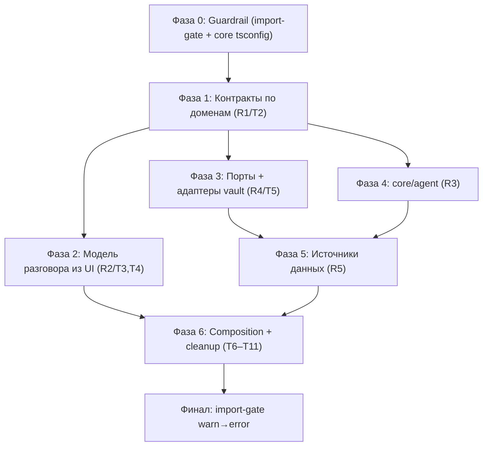

# Implementation Plan — Ixplorer Core Extraction (Stage 1)

**Источники:** [SPEC-ixplorer-core-extraction.md](../docs/SPEC-ixplorer-core-extraction.md),
[SPEC-core-module-design.md](../docs/SPEC-core-module-design.md).
**Цель:** платформенно-независимое ядро — в `core/` и `application/` нет импортов
`obsidian` / DOM / fs. Единственный рантайм — Obsidian-плагин. Никаких Hermes/OpenClaw/bridge.
**Инвариант каждого шага:** `npm test` + `npx tsc --noEmit` зелёные; поведение плагина не меняется;
legacy не удаляется (только перемещается за границы).

---

## Принципы нарезки
- **Вертикальные срезы:** где возможно — один завершённый путь (контракт → реализация → потребитель →
  тест), а не «сначала все типы, потом все адаптеры».
- **Strangler через barrel:** при переносе типов/модулей старый путь остаётся реэкспортом, импортеры
  мигрируют постепенно, затем реэкспорт удаляется. Это держит каждый коммит зелёным.
- **Guardrail вперёд:** тест направления импортов ставится первым (в режиме baseline/warn), чтобы новые
  нарушения не появлялись по ходу работ; в конце переключается в error.

---

## Граф зависимостей фаз

Критические зависимости:
- `core/model` (1.1) нужен раньше conversation (Фаза 2), портов (Фаза 3) и agent (Фаза 4).
- Источники (Фаза 5) требуют и портов (Фаза 3), и обобщённого `ToolManager` (Фаза 4).
- Переключение gate в error — только после Фазы 6 (когда `main.ts`/composition развязаны).

---

## Фаза 0 — Guardrail

### 0.1 — Import-boundary test + core typecheck (T1)
Кастомный тест (`tests/arch/import-boundaries.test.ts`), сканирующий импорты и проверяющий разрешённые
направления `apps → adapters → application → core`. Старт в режиме **baseline**: текущие известные
нарушения (`research/ResearchService → ui/rendering`, `chat/* → ui/rendering`, `research/types →
retrieval/RetrievalService`) занесены в allowlist; новые — падают. Плюс `tsconfig.core.json` (lib без
`DOM`, без `obsidian` типов) для будущей проверки изоляции ядра (пока охватывает только уже чистые папки).
- **Acceptance:** новый файл-нарушитель в `core/` ломает тест; baseline-нарушения зафиксированы списком.
- **Verify:** `npm test`; временно добавить импорт `obsidian` в фейковый core-файл → тест красный → откатить.
- **Зависит от:** —

---

## Фаза 1 — Контракты по доменам (R1 / T2)

Разнести `shared/types.ts` (766 стр., 84 импортёра). Каждая подзадача: создать доменный файл, перенести
типы, оставить реэкспорт в `shared/types.ts`, прогнать typecheck+тесты.

### 1.1 — `core/model/*` (source, chunk, citation)
`SourceReference*`, `ExtractedChunk`, `EmbeddedChunk`, `RetrievedChunk`, `SourceKind`, `DocumentFormat`,
`Citation`, `LanguageInventoryItem` → `core/model/`.
- **Acceptance:** `core/model` не импортирует ничего из `shared/`, `obsidian`, DOM; `shared/types.ts`
  реэкспортирует перенесённое.
- **Verify:** `npx tsc --noEmit && npm test`.
- **Зависит от:** 0.1

### 1.2 — `core/agent/protocol.ts` (чат/модель-протокол)
`ChatMessage`, `ChatRequest`, `ModelRound*`, `ModelStreamEvent`, `ChatTool*`, `ReasoningCapabilities`,
`ToolCallingCapabilities`, `ApiFormat`, `ChatApiProtocol`, `EmbeddingRequest/Response` → доменные файлы.
- **Acceptance:** клиенты (`client/chat/*`, `client/embeddings/*`) импортируют из новых путей или barrel.
- **Verify:** `npx tsc --noEmit && npm test`.
- **Зависит от:** 1.1

### 1.3 — `application/ports/contracts` (хранилища/retrieval/web)
`IndexStore*`, `Extractor`, `RetrievalOptions`, `Retriever`, `KeywordSearchIndexStore`,
`SearchProvider`, `WebSearchOptions`, `WebPageFetch*` → `application/ports/` (или `*/contracts.ts`).
- **Acceptance:** `indexing`/`retrieval`/`web` импортируют контракты из новых модулей.
- **Verify:** `npx tsc --noEmit && npm test`.
- **Зависит от:** 1.1

### 1.4 — `research/diagnostics.ts` + `research/answer.ts`
Весь блок `*Diagnostics` (~370 стр.) и `ResearchAnswer` → в research-домен. После — удалить барахло из
`shared/types.ts`, оставив только то, что реально общее (или удалить файл, заменив barrel).
- **Acceptance:** `shared/types.ts` ≤ ~50 строк (только реэкспорт) либо удалён; `grep "shared/types"`
  показывает только переходные импорты.
- **Verify:** `npx tsc --noEmit && npm test`.
- **Зависит от:** 1.1, 1.2, 1.3

> **CHECKPOINT A** (human review): god-module устранён, домены разделены, всё зелёное.

---

## Фаза 2 — Модель разговора из UI (R2 / T3, T4)

### 2.1 — `core/conversation/` (модель + чистые reducers) (T3)
Перенести `ChatDisplayMessage`→`ConversationMessage`, `ConversationCompactionSummary`, `ReasoningSegment`,
`ChainItem`, `AssistantReasoningState` и чистые reducers (`nextAssistant*`, `nextChain*`, `finalize*`,
`interrupt*`) из `ui/rendering.ts` в `core/conversation/`. `research`/`chat`/`ui` импортируют из core.
- **Acceptance:** `research/ResearchService.ts`, `chat/ChatStore.ts`, `chat/ChatCompaction.ts` больше не
  импортируют из `ui/`; baseline-нарушение убрано из allowlist (тест 0.1 это требует).
- **Verify:** `npx tsc --noEmit && npm test`; allowlist в import-test уменьшился на 3 записи.
- **Зависит от:** 1.1 (Citation/model)

### 2.2 — `ui/conversationFormatting.ts` (T4)
Остаток `ui/rendering.ts` (Obsidian-/презентационные форматтеры: `formatIndexingStatus`,
`citationTarget`, `messageMarkdownContent`, `stripFollowUpSection`…) → `ui/conversationFormatting.ts`;
`rendering.ts` удалить или оставить тонким реэкспортом для UI.
- **Acceptance:** в `core/conversation` нет форматтеров с DOM/Obsidian; UI-форматтеры в `ui/`.
- **Verify:** `npx tsc --noEmit && npm test`; `tsconfig.core.json` охватывает `core/conversation` и проходит.
- **Зависит от:** 2.1

---

## Фаза 3 — Порты + адаптеры vault (R4 / T5)

### 3.1 — Boundary DTO в `application/contracts` + порты vault/retrieval/web
Перенести `RetrievalResult` из `retrieval/RetrievalService` в `application/contracts` (убрать утечку из
`research/types.ts:1`). Объявить `VaultContentPort`, `VaultGraphPort`, `VaultWritePort`,
`ActiveDocumentPort`, `RetrievalIndexPort`, `WebSearchPort`, `EmbeddingPort` в `application/ports/`.
- **Acceptance:** `research/types.ts` не импортирует конкретный `RetrievalService`; порты не зависят от `obsidian`.
- **Verify:** `npx tsc --noEmit && npm test`; allowlist-нарушение `research/types→RetrievalService` снято.
- **Зависит от:** 1.1, 1.3

### 3.2 — Перенос Obsidian-провайдеров в `adapters/obsidian/`
Переместить `ObsidianVaultFileProvider`, `ObsidianContextFileProvider`, `ObsidianGraphContextProvider`,
`ObsidianVaultWriter` в `adapters/obsidian/`, привести к реализации портов 3.1 (без смены поведения).
Composition root (`main.ts`) обновляет импорты.
- **Acceptance:** прямые импорты `obsidian` остаются только в `adapters/obsidian/` и `apps/obsidian/` (UI);
  contract-тест адаптера (in-memory сравнение DTO) добавлен.
- **Verify:** `npx tsc --noEmit && npm test`; `grep -rl '"obsidian"' src | grep -v adapters/obsidian | grep -v ui` пуст (кроме apps).
- **Зависит от:** 3.1

---

## Фаза 4 — core/agent: обобщить tools (R3)

### 4.1 — Поднять и переименовать tool-инфраструктуру в `core/agent/`
`ResearchToolHandler`→`Tool`, `ResearchToolRegistry`→`ToolManager`, `runToolLoop`→`AgentLoop`,
`ResearchToolExecution`→`ToolResult`. Убрать research-специфичные имена из универсального слоя; `ToolContext`
получает `signal` (AbortSignal) и `emit` (события). Конкретные tools (`IndexResearchTool` и т.д.) пока
остаются на месте, но реализуют `Tool` из core.
- **Acceptance:** `core/agent` зависит только от `core/model` и протокол-порта; добавление нового tool =
  реализация `Tool` + `register`, без правок ядра (демонстрируется тестом с фейковым tool).
- **Verify:** `npx tsc --noEmit && npm test`; существующие tool-loop тесты проходят без изменения поведения.
- **Зависит от:** 1.1, 1.2

---

## Фаза 5 — Источники данных (R5)

Вертикальные срезы: каждый источник — порт → `DataSource` → его `Tool` → регистрация в `ToolManager`.

### 5.1 — `application/sources/`: `DataSource` + `SourceManager` + RAG end-to-end
Объявить `DataSource`, `DataSourceDescriptor`, `SourceManager`. Реализовать `RagSource` поверх
`RetrievalIndexPort`/`EmbeddingPort`, отдающий `IndexResearchTool` как `Tool`. Заменить ручную сборку из
`createResearchToolRegistry` на `SourceManager.contributeTools(toolManager)` для RAG.
- **Acceptance:** `SourceManager.descriptors()` показывает RAG-источник; его tool исполняется в `AgentLoop`;
  `createResearchToolRegistry` для RAG-ветки делегирует SourceManager.
- **Verify:** `npx tsc --noEmit && npm test`; новый тест: SourceManager регистрирует RAG-tool в ToolManager.
- **Зависит от:** 3.1, 4.1

### 5.2 — `WebSource` (web search/fetch)
`WebSource` поверх `WebSearchPort`, отдаёт `WebSearchResearchTool`/`WebFetchResearchTool`. Доступность
= зарегистрирован или нет (заменяет `webProviderAvailable`).
- **Acceptance:** включение/выключение web = `register` или нет; descriptors отражают доступность.
- **Verify:** `npx tsc --noEmit && npm test`.
- **Зависит от:** 5.1

### 5.3 — `AttachmentSource` (явные вложения/note tools)
`AttachmentSource` поверх `VaultContentPort`/`ActiveDocumentPort`, отдаёт `NoteTools`-handlers.
Полностью убрать `availability`-матрицу из `createResearchToolRegistry` в пользу композиции источников.
- **Acceptance:** `createResearchToolRegistry` либо удалён, либо стал тонкой обёрткой над `SourceManager`;
  поведение tool-набора идентично (тесты доступности проходят).
- **Verify:** `npx tsc --noEmit && npm test`.
- **Зависит от:** 5.2

> **CHECKPOINT B** (human review): agent loop, ToolManager и источники развязаны; ядро не знает Obsidian.

---

## Фаза 6 — Composition + cleanup (T6–T11)

### 6.1 — `ChatRepository` порт + `FileChatRepository` адаптер (T6)
Разделить `FileChatStore`: DTO/правила (core), `ChatRepositoryPort` (application), Node fs
(`adapters/filesystem`). Заодно `chat/ChatStore` перестаёт зависеть от UI-модели (если ещё зависит).
- **Acceptance:** `application` ссылается на порт, не на fs; смена хранилища = новый адаптер.
- **Verify:** `npx tsc --noEmit && npm test`.
- **Зависит от:** 2.1

### 6.2 — `ServiceFactory` + `ResponsesProviderPolicy` + дедуп экстракторов (T7, T9)
Вынести `create*ForProfile` из `main.ts` в `composition/ServiceFactory`; политику протокола/reasoning из
`createResponsesRoundProvider` → чистая `ResponsesProviderPolicy` (юнит-тесты без плагина); объединить две
фабрики экстракторов в одну параметризованную; убрать `MarkdownExtractor.fromSettings`-утечку.
- **Acceptance:** `main.ts` ≤ ~250 строк (lifecycle + регистрация); `ResponsesProviderPolicy` покрыта тестом.
- **Verify:** `npx tsc --noEmit && npm test`.
- **Зависит от:** 3.2, 5.3

### 6.3 — Группировка опций `ResearchService` + минимальные порты (T8)
`ResearchServiceOptions` (25+ полей) → когезивные под-объекты (`collaborators`/`modelConfig`/`toolConfig`/
`contextConfig`/`diagnostics`); заменить ссылки на конкретные сервисы минимальными интерфейсами
(`QueryExpander` и т.д.).
- **Acceptance:** конструктор принимает сгруппированные объекты; публичные параметры не ссылаются на
  конкретные классы.
- **Verify:** `npx tsc --noEmit && npm test`.
- **Зависит от:** 6.2

### 6.4 — Конфигурируемый путь сборки (T10)
`esbuild.config.mjs`: путь bundle → env/параметр; дефолт сохраняет текущее поведение.
- **Acceptance:** `npm run build` пишет в настраиваемый путь; без env — как раньше.
- **Verify:** `npm run build` (с временным OUT-путём в scratchpad).
- **Зависит от:** —

### 6.5 — Расщепить `SettingsTab.ts` (T11)
2418 строк → секции-рендереры (`renderServerProfilesSection` и т.д.), каждая принимает контейнер+контекст.
- **Acceptance:** `SettingsTab.ts` — тонкий координатор; секции в отдельных файлах; UI идентичен.
- **Verify:** `npx tsc --noEmit && npm test`; ручная проверка вкладки настроек.
- **Зависит от:** —

---

## Финал

### F.1 — Переключить import-gate warn → error
Allowlist baseline пуст; тест 0.1 в строгом режиме. `tsconfig.core.json` охватывает весь `core/` +
`application/` и проходит без `DOM`/`obsidian`.
- **Acceptance:** все критерии готовности из SPEC §10 выполнены; gate строгий.
- **Verify:** `npm test`, `npx tsc -p tsconfig.core.json --noEmit`, `npx tsc --noEmit`, `npm run build`.
- **Зависит от:** все фазы

---

## Контрольные точки для ревью
- **CHECKPOINT A** — после Фазы 1 (контракты разнесены).
- **CHECKPOINT B** — после Фазы 5 (ядро/agent/источники развязаны).
- **Финал F.1** — gate строгий, критерии §10 закрыты.

## Риски
- Большое число импортёров `shared/types` (84) → миграция через barrel обязательна, иначе гигантский коммит.
- `tsconfig.core.json` может вскрыть скрытые DOM-зависимости в «ядре» → выявляем рано (0.1), чиним по ходу.
- Перенос провайдеров (3.2) и SettingsTab (6.5) объёмны → держать как отдельные коммиты, без смены поведения.
